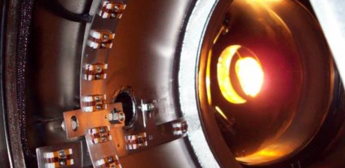
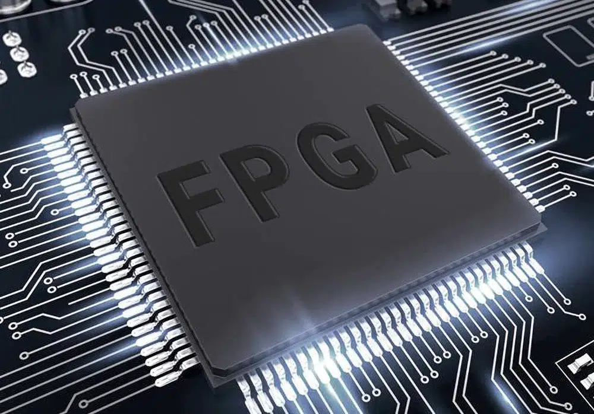
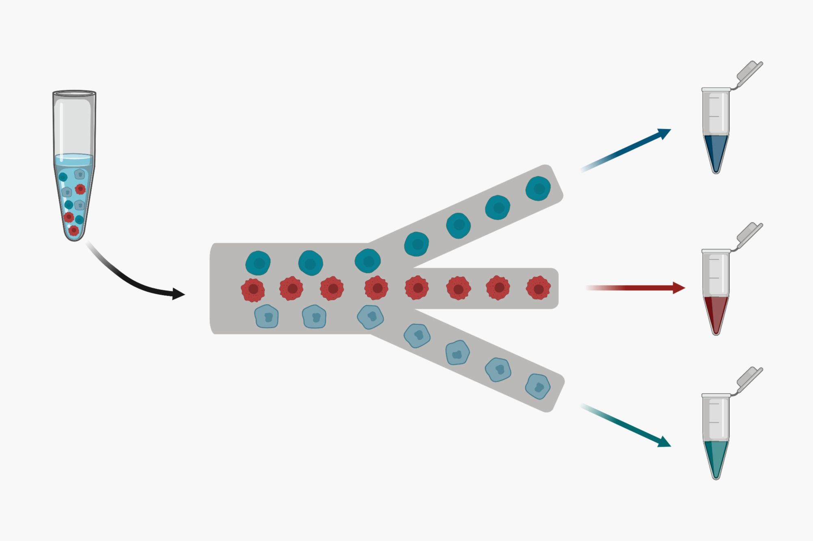

# Welcome to my website!

## Bio

Hello, my name is Ryan Forelli. I am a PhD student at Northwestern University studying Computer Engineering.

## Research Overview
My focus is on AI accelerators and HW/SW co-design techniques and tools to empower AI engineers. I primarily work on accelerators for applications in scientific experimentation in domains such as fusion energy, biological cell-sorting, materials characterization, high-energy physics, and more.

## Projects

### Fusion Instability suppression

Magneto hydrodynamic (MHD) instability is one major obstacle in the way of bringing fusion to the forefront as a clean alternative energy solution. In this project, my group and I developed an optical and machine learning approach to real-time MHD instability suppression on Field Programmable Gate Arrays (FPGAs). Read more about it in our paper here!
https://arxiv.org/abs/2312.00128

### A methodology for in-hardware FIFO monitoring in FPGAs

FPGAs are a versatile tools for achieving ultra low latency inference for any application. However, doing so requires a careful balance between algorithm parallelization and FPGA resources. One such resource, BRAMs, are used to construct FIFO data structures on an FPGA and are critical to most FPGA designs. However, these resources are often overutilized, and there exists no 100% software simulation tool for estimating the true FIFO usage of an FPGA design. Thus, this work introduces a new in-hardware FIFO profiling tool so that engineers can obtain 100% accurate reports of FIFO usage, which they can use to back-annotate to their design and save resources. Read more about it in our paper here!
https://ieeexplore.ieee.org/stamp/stamp.jsp?arnumber=10538570

### High-speed cell sorting

Traditional methods for cell labeling such as cytometry are costly and can negatively impact the integrity of the cells. Thus, in this project I helped develop a framework for real-time (<100us) cell-sorting with machine learning on FPGAs.
Read more about it in our paper here!
<paper coming soon!>

©uFluidix 2024

### Service work

I believe it is important to give back to the community that has provided me with so much! These are a few ways I try to do that.

- I am a Reviewer for IEEE Transactions on Computer-Aided Design of Integrated Circuits and Systems. This is a volunteer position. I find it very beneficial in that I get to keep myself up to date on what is happening in the field.

- Mentor: I have mentored multiple undergraduate students in their research projects primarily revolving around ML for materials applications.

- Teaching: I have instructed about 40+ free introductory 3D printing and design classes at a local makerspace and libraries to elementary students, business owners, and senior citizens. One objective of these classes was to foster innovation and promote STEM in rural low-income communities 

Please feel free to contact me about my work at forelliryan@gmail.com
